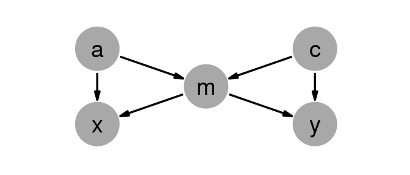

<!-- README.md is generated from README.Rmd. Please edit that file -->

# raldag

<!-- badges: start -->
<!-- badges: end -->

Create and generate data from DAGs.

## Installation

You can install the development version from
[GitHub](https://github.com/) with:

``` r
# install.packages("devtools")
devtools::install_github("ianmoran11/raldag")
```

## Example

``` r
rm(list = ls())
library(tidyverse)
library(tidygraph)
library(ggraph)
library(patchwork)
library(magrittr)
library(ralget)
library(ggforce)
library(raldag)
```

### Specify how nodes generate data and evaluate inputs

``` r
a <- v("a", .f = d(~ rnorm(n = 1000, mean = rsum(.x), sd = .5)))
c <- v("c", .f = d(~ rnorm(n = 1000, mean = rsum(.x), sd = .5)))
x <- v("x", .f = d(~ rnorm(n = 1000, mean = rsum(.x), sd = .5)))
y <- v("y", .f = d(~ rnorm(n = 1000, mean = rsum(.x), sd = .5)))
m <- v("m", .f = d(~ rnorm(n = 1000, mean = rsum(.x), sd = .5)))
```

### Declare causal connections

``` r
g <-
 (a * b(1) + m * b(1)) * x +
 (c * b(1) + m * b(1)) * y +
 (a * b(1) + c * b(1)) * m

dag_plot(g)
```



### Generate data from DAG

``` r
obs <- g %>% simulate(label = "Observational")
do0 <- g %>% ralget::do(a = -1) %>% simulate(label = "do(a = -1)",seed = 1)
do1 <- g %>% ralget::do(a =  1) %>% simulate(label = "do(a =  1)",seed = 1)
```

### Compare intervention distributions

``` r
bind_rows(obs, do0, do1) %>% plot_joint_distributions()
```


