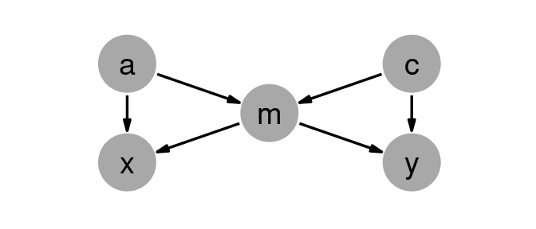
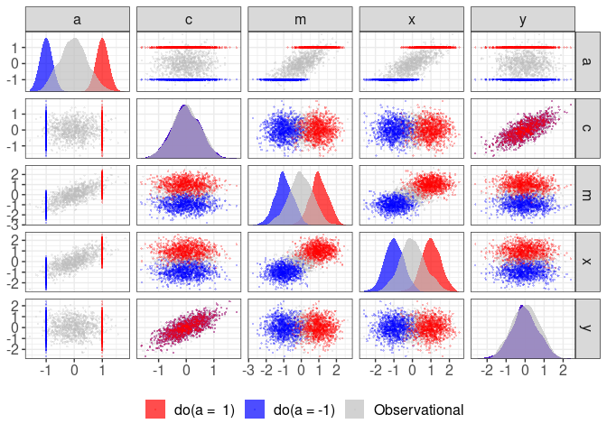

<!-- README.md is generated from README.Rmd. Please edit that file -->

# raldag

<!-- badges: start -->
<!-- badges: end -->

The goal of raldag is to …

## Installation

You can install the released version of raldag from
[CRAN](https://CRAN.R-project.org) with:

``` r
install.packages("raldag")
```

Create and generate data from DAGs.

build ## Example

``` r
rm(list = ls())
library(tidyverse)
#> ── Attaching packages ────────────────────────────────────────────────────────────────────────────────────────────────────────────────────────────────────────────── tidyverse 1.3.1 ──
#> ✔ ggplot2 3.3.3     ✔ purrr   0.3.4
#> ✔ tibble  3.1.1     ✔ dplyr   1.0.5
#> ✔ tidyr   1.1.3     ✔ stringr 1.4.0
#> ✔ readr   1.4.0     ✔ forcats 0.5.1
#> ── Conflicts ───────────────────────────────────────────────────────────────────────────────────────────────────────────────────────────────────────────────── tidyverse_conflicts() ──
#> ✖ dplyr::do()     masks raldag::do()
#> ✖ dplyr::filter() masks stats::filter()
#> ✖ dplyr::lag()    masks stats::lag()
library(tidygraph)
#> 
#> Attaching package: 'tidygraph'
#> The following object is masked from 'package:stats':
#> 
#>     filter
library(ggraph)
library(patchwork)
library(magrittr)
#> 
#> Attaching package: 'magrittr'
#> The following object is masked from 'package:purrr':
#> 
#>     set_names
#> The following object is masked from 'package:tidyr':
#> 
#>     extract
library(ralget)
#> 
#> Attaching package: 'ralget'
#> The following object is masked from 'package:dplyr':
#> 
#>     do
#> The following objects are masked from 'package:raldag':
#> 
#>     b, do, extract_data, increment_t, rsum, simulate, unsafe_rsum
#> The following object is masked from 'package:stats':
#> 
#>     simulate
#> The following object is masked from 'package:base':
#> 
#>     %x%
library(ggforce)
library(raldag)
```

### Specify how nodes generate data and evaluate inputs

``` r
a <- v("a", .f = d(~ rnorm(n = 1000, mean = rsum(.x), sd = .5)))
c <- v("c", .f = d(~ rnorm(n = 1000, mean = rsum(.x), sd = .5)))
x <- v("x", .f = d(~ rnorm(n = 1000, mean = rsum(.x), sd = .5)))
y <- v("y", .f = d(~ rnorm(n = 1000, mean = rsum(.x), sd = .5)))
m <- v("m", .f = d(~ rnorm(n = 1000, mean = rsum(.x), sd = .5)))
```

### Declare causal connections

``` r
g <-
 (a * b(1) + m * b(1)) * x +
 (c * b(1) + m * b(1)) * y +
 (a * b(1) + c * b(1)) * m

dag_plot(g)
```



### Generate data from DAG

``` r
obs <- g %>% simulate(label = "Observational")
do0 <- g %>% ralget::do(a = -1) %>% simulate(label = "do(a = -1)",seed = 1)
do1 <- g %>% ralget::do(a =  1) %>% simulate(label = "do(a =  1)",seed = 1)
```

### Compare intervention distributions

``` r
bind_rows(obs, do0, do1) %>% plot_joint_distributions()
```


