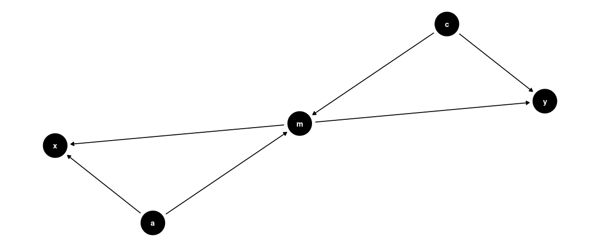

<!-- README.md is generated from README.Rmd. Please edit that file -->

# raldag <a> </a>

<!-- badges: start -->

[](https://lifecycle.r-lib.org/articles/stages.html#experimental)
[](https://codecov.io/gh/ianmoran11/raldag?branch=master)
[](https://github.com/ianmoran11/raldag/actions)
<!-- badges: end -->

`raldag` helps you create DAGs and generate data from them.

### Specify how nodes generate data and evaluate inputs

Declare the nodes of your DAG and how data is generated by those nodes
with the following code:

``` r
c <- v("c", .f = d(~ rnorm(n = 10^4, mean = rsum(.x) + 10, sd =  1)))
a <- v("a", .f = d(~ rnorm(n = 10^4, mean = rsum(.x)     , sd =  1)))
x <- v("x", .f = d(~ rnorm(n = 10^4, mean = rsum(.x) +  5, sd =  1)))
y <- v("y", .f = d(~ rnorm(n = 10^4, mean = rsum(.x) +  2, sd =  1)))
m <- v("m", .f = d(~ rnorm(n = 10^4, mean = rsum(.x) +  8, sd =  1)))
```

In this case, the node `c` generates 1000 observations with a mean equal
to the sum of its input edges plus 10 and a standard deviation of 4.

### Declare causal connections

Causal connections between nodes as well as coefficients are specified
with the graph syntax from
[ralget](https://github.com/ianmoran11/ralget)

``` r
 (a * b(10) + m * b(10)) * x +
 (c * b(10) + m * b(10)) * y +
 (a * b(10) + c * b(10)) * m
```



### Generate data from DAG

Now that we have a DAG with an underlying data generating process, we
can simulate data:

``` r
g %>% simulate(seed = 123)
#> # A tibble: 10,000 × 7
#>   sim_id      a     c     m     x     y label         
#>    <int>  <dbl> <dbl> <dbl> <dbl> <dbl> <chr>         
#> 1      1  2.37   9.81  130. 1329. 1401. simulation set
#> 2      2 -0.167 10.3   110. 1101. 1203. simulation set
#> 3      3  0.927  9.46  111. 1126. 1208. simulation set
#> # … with 9,997 more rows
```

### Introduce interventions

We can also examine causal effects using interventions, inspired by
Pearl’s
[do-calculus](https://en.wikipedia.org/wiki/Causal_model#Do_calculus).

For example, we can set `a` to 0:

``` r
g %>% manipulate(a = 0) %>% simulate(seed = 123)
#> # A tibble: 10,000 × 7
#>   sim_id     a     c     m     x     y label         
#>    <int> <dbl> <dbl> <dbl> <dbl> <dbl> <chr>         
#> 1      1     0  9.81  106. 1069. 1164. simulation set
#> 2      2     0 10.3   111. 1119. 1220. simulation set
#> 3      3     0  9.46  102. 1024. 1116. simulation set
#> # … with 9,997 more rows
```

And we could compare that with what happens when `a` is set to 1:

``` r
g %>% manipulate(a = 1) %>% simulate(seed = 123)
#> # A tibble: 10,000 × 7
#>   sim_id     a     c     m     x     y label         
#>    <int> <dbl> <dbl> <dbl> <dbl> <dbl> <chr>         
#> 1      1     1  9.81  116. 1179. 1264. simulation set
#> 2      2     1 10.3   121. 1229. 1320. simulation set
#> 3      3     1  9.46  112. 1134. 1216. simulation set
#> # … with 9,997 more rows
```

### Compare intervention distributions

Here’s how our intervention on `a` has affected the variables in our
DAG/DGP.

``` r
bind_rows(obs, do0, do1) %>% 
  gather(var,value, -sim_id,-label) %>%
  plot_distributions()
```


## Installation

You can install the development version from
[GitHub](https://github.com/) with:

``` r
# install.packages("devtools")
devtools::install_github("ianmoran11/raldag")
```
